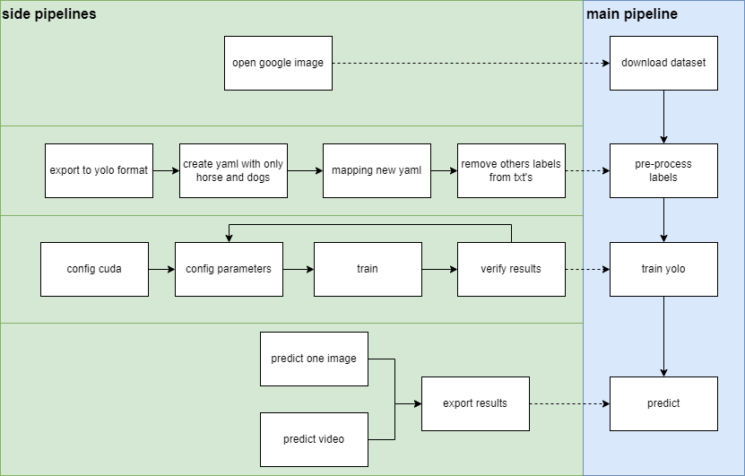

# Project Report: Object Detection with YOLO

## Solution Overview
The solution followed the steps outlined in the accompanying design sketch.

### Step 1: Dataset Download
The initial step involved downloading the dataset. I used FiftyOne to download a sample of the horse and dog datasets from Open Images (Google's dataset).

### Step 2: Dataset Transformation
The second step was to transform the dataset into a format compatible with YOLO. FiftyOne provides a built-in function to facilitate this transformation.

### Step 3: Pre-process Label
In the third step, I created a YAML file specifically for the dog and horse classes, as the original Open Images YAML contained many classes. It was necessary to map the indexes from my YAML to those of the Open Images YAML, followed by the removal of irrelevant labels and the modification of the dog and horse labels to align with my YAML.

## YOLO Training
First, I configured CUDA because training using only the CPU is time-consuming. Subsequently, I modified some default parameters and conducted training over 200 epochs. It was crucial to analyze the results to determine the need for retraining or improvements within the dataset itself.

## Prediction Script
Finally, I developed a prediction script, which required creating a function to predict on a single image and a video.

## Results
The project achieved good results, as detailed in the following table:

| Class | Images | Instances | Box(P) | R | mAP50 | mAP50-95 |
|-------|--------|-----------|--------|---|-------|----------|
| All   | 5639   | 7026      | 0.833  | 0.83 | 0.86   | 0.727    |
| Dog   | 4835   | 5856      | 0.943  | 0.881 | 0.944 | 0.81     |
| Horse | 811    | 1170      | 0.722  | 0.778 | 0.776 | 0.644    |

|                | Accuracy       |
|----------------|----------------|
| Dog            | 0.9165         |
| Horse          | 0.8342         |
| Overall Model  | 0.7922         |

For improved outcomes, testing other architectures or heavier versions of YOLO, adding more datasets, or implementing further data augmentation could be beneficial. There are various avenues for enhancement.

## Challenges
Using YOLO, especially with default parameters, was straightforward; hence, no significant issues arose during training. Most of the time was spent understanding FiftyOne better for downloading and managing the dataset.
